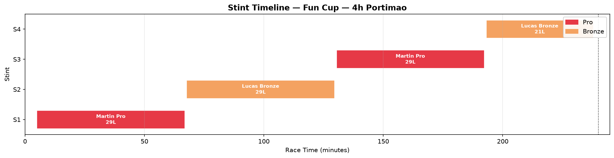
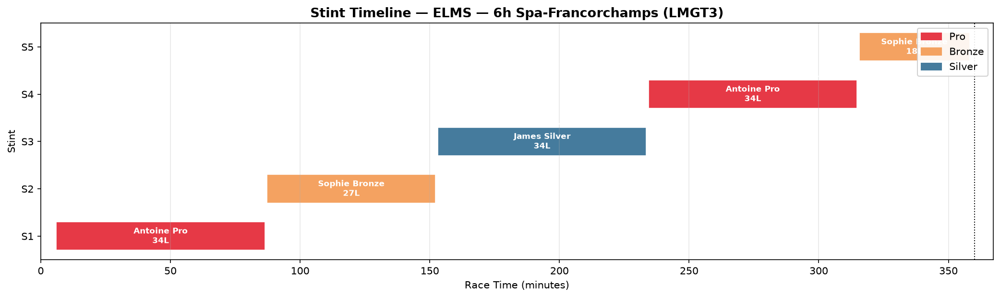

# Endurance Race Stint Planner

[](https://www.python.org/)
[](https://pandas.pydata.org/)
[](https://matplotlib.org/)
[](LICENSE)

**A Python race-strategy tool for endurance sportscar championships** — built as a portfolio project for roles in **Fun Cup**, **Lamera Cup**, **ELMS**, and **WEC**.

Plan fuel-limited stints, rotate Pro / Silver / Bronze drivers within regulatory limits, define pit windows, and re-plan instantly when a Safety Car drops.

**Repository:** [github.com/Dabi-init/endurance-stint-planner](https://github.com/Dabi-init/endurance-stint-planner)

---

## At a Glance

| Capability | What it does |
|------------|--------------|
| Fuel geometry | Laps and minutes per stint from tank size, consumption, and safety margin |
| Driver rotation | Pro / Silver / Bronze stints with min/max drive-time rules |
| Pit windows | Earliest and latest pit entry for each stop |
| Safety Car re-plan | Rebuilds the remaining schedule after an SC |
| Table output | Pandas stint plan in the terminal or CSV |
| Timeline chart | Matplotlib Gantt chart for briefings |

---

## Screenshots

**Fun Cup — 4h (Pro + Bronze)**



**ELMS — 6h Spa LMGT3 (Pro + Silver + Bronze)**



---

## How to Run

You only need **Python 3.10+** and two packages (`pandas`, `matplotlib`). No prior coding experience required — follow these steps exactly.

### Step 1 — Download the project

```bash
git clone https://github.com/Dabi-init/endurance-stint-planner.git
cd endurance-stint-planner
```

### Step 2 — Create a virtual environment (recommended)

A virtual environment keeps this project's packages separate from the rest of your computer.

**Windows (PowerShell or Command Prompt):**

```bash
python -m venv .venv
.venv\Scripts\activate
```

**macOS / Linux:**

```bash
python3 -m venv .venv
source .venv/bin/activate
```

You know it worked when you see `(.venv)` at the start of your terminal line.

### Step 3 — Install dependencies

```bash
pip install -r requirements.txt
```

### Step 4 — Run your first plan

```bash
python endurance_stint_planner.py --preset fun-cup
```

You should see a fuel summary followed by a full stint table in the terminal.

### Step 5 — Verify everything works (optional)

```bash
python endurance_stint_planner.py --self-test
```

This runs all presets, a Safety Car scenario, and custom driver input. You should see `All self-tests passed.` at the end.

### More commands to try

```bash
# Save a timeline chart (no pop-up window)
python endurance_stint_planner.py --preset fun-cup --output outputs/fun_cup.png

# Export stint table to CSV
python endurance_stint_planner.py --preset elms --export-csv outputs/elms_plan.csv

# Safety Car re-plan at race minute 125, extend stint by 8 minutes
python endurance_stint_planner.py --preset fun-cup --safety-car 125 --extend-stint 8

# Show interactive chart
python endurance_stint_planner.py --preset wec --plot
```

### Troubleshooting

| Problem | Solution |
|---------|----------|
| `python` not found | Try `python3` instead, or install Python from [python.org](https://www.python.org/downloads/) |
| `pip` not found | Run `python -m pip install -r requirements.txt` |
| Chart window does not open | Use `--output path/to/chart.png` to save a file instead of `--plot` |
| `Configuration error` | Use a `--preset` or provide all custom fields (`--race-hours`, `--lap-time`, `--tank`, `--fuel-per-lap`) |

---

## Championship Presets

| Preset | Series | Duration | Driver lineup |
|--------|--------|----------|---------------|
| `fun-cup` | Fun Cup / Lamera Cup GT4 | 4 hours | Pro + Bronze |
| `elms` | ELMS LMGT3 | 6 hours | Pro + Silver + Bronze |
| `wec` | WEC Hypercar | 6 hours | Pro + Pro + Bronze |

```bash
python endurance_stint_planner.py --preset fun-cup
python endurance_stint_planner.py --preset elms
python endurance_stint_planner.py --preset wec
```

---

## Example Output — Fun Cup 4h

```
Fuel geometry: 29 laps/stint (1:01:52)
Lap time: 128.000s  |  Consumption: 2.60 L/lap  |  Tank: 80 L

 Stint       Driver Category   Start     End Duration  Laps  Fuel (L)
     1   Martin Pro      Pro    5:00 1:06:52  1:01:52    29      75.4
     2 Lucas Bronze   Bronze 1:07:42 2:09:34  1:01:52    29      75.4
     3   Martin Pro      Pro 2:10:24 3:12:16  1:01:52    29      75.4
     4 Lucas Bronze   Bronze 3:13:06 3:57:54    44:48    21      54.6

Total stints: 4  |  Pit stops: 3

Driver totals:
  Martin Pro            2:03:44  (51.6% of race)
  Lucas Bronze          1:46:40  (44.4% of race)
```

Bronze meets the typical ~40% minimum drive requirement (96 minutes).

---

## Custom Race Setup

```bash
python endurance_stint_planner.py ^
  --race-hours 4 ^
  --race-name "Test Day" ^
  --lap-time 2:08 ^
  --tank 80 ^
  --fuel-per-lap 2.6 ^
  --drivers "Martin:Pro:45:90:0,Lucas:Bronze:45:65:96"
```

**Driver format:** `Name:Category:min_stint:max_stint:min_total_minutes`

Leave a field blank to use the default. Example: `Martin:Pro::90:0` keeps the default 45 min minimum stint.

**Categories:** `Pro`, `Silver`, `Bronze`, `Amateur`

---

## Strategy Logic

### 1. Fuel-limited stint

```
usable_fuel = tank_capacity - (safety_laps x consumption_per_lap)
laps_per_stint = floor(usable_fuel / consumption_per_lap)
```

A one-lap safety margin avoids running the tank dry under traffic or Safety Car conditions.

### 2. Driver rotation

Each stint is capped at the minimum of:

- Fuel-limited stint length
- Driver maximum (Bronze capped at 65 min/stint in WEC/ELMS)
- Remaining race time

Drivers below their **minimum total drive** are prioritised, while avoiding unnecessary back-to-back stints when another driver is available.

### 3. Pit windows

- **Open** = stint start + driver minimum stint
- **Close** = stint end (fuel limit)

### 4. Safety Car re-plan

`--safety-car` preserves completed stints, can extend the active stint, applies reduced pit loss, and rebuilds the remaining schedule.

---

## Project Structure

```
endurance-stint-planner/
├── endurance_stint_planner.py   # Main application
├── requirements.txt
├── LICENSE
├── README.md
├── docs/                        # Timeline images
└── outputs/                     # Your generated files (git-ignored)
```

---

## Why This Matters for Strategy Roles

This project shows you can:

- Translate **fuel windows** and **pit timing** into a structured pre-race plan
- Apply **FIA driver category rules** (Pro / Silver / Bronze min-max stints)
- **Re-plan under Safety Car** — a real pit-wall scenario
- Present output in formats strategists use: **tables**, **CSV**, and **timeline charts**

---

## Author

**Sreenath R.** — ESSEC MIM 2026

Endurance motorsport strategy | Python for race operations | Targeting sportscar strategy and race engineering roles (Fun Cup, Lamera Cup, ELMS, WEC).

- **GitHub:** [@Dabi-init](https://github.com/Dabi-init)
- **Project:** [endurance-stint-planner](https://github.com/Dabi-init/endurance-stint-planner)

---

## Future Improvements

- [ ] Live timing / telemetry import
- [ ] Tyre stint and compound modelling
- [ ] Multi-car offset and undercut windows
- [ ] Streamlit dashboard for real-time use
- [ ] Automated unit tests for regulatory edge cases

---

## Licence

MIT — see [LICENSE](LICENSE).