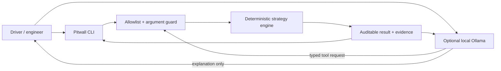

<p align="center">
  
</p>

<h1 align="center">Pitwall Agent</h1>

<p align="center">
  A local-first endurance race strategist that lets AI explain the plan—but never invent the maths.
</p>

<p align="center">
  <a href="https://github.com/Dabi-init/endurance-stint-planner/actions/workflows/ci.yml"></a>
  <a href="https://github.com/Dabi-init/endurance-stint-planner/actions/workflows/codeql.yml"></a>
  <a href="LICENSE"></a>
  
  
  
</p>

Most racing calculators stop at “how many laps fit in a tank?” Pitwall Agent
compares complete, executable strategies: fuel loads and additions, driver
rotation, tyre sets, parallel or sequential pit service, uncertainty, configured
driver rules, and a scoped Safety Car what-if.

It is terminal software—not a website. It works without a language model. If
you connect a local [Ollama](https://ollama.com/) model, the model can translate
plain English into allowlisted race-tool calls and explain the result. The model
never receives shell, browser, deletion, arbitrary-file, or arbitrary-network
tools.

```text
> pitwall compare

Recommendation: Conservative

Rank  Strategy      Projected laps  P10 laps  Pit stops  Reserve  Risk
1     Conservative  174             174.0     6          2 laps   Low
2     Balanced      174             174.0     6          1 lap    Low
3     Fuel Save     174             173.0     6          1 lap    Low

Evidence C · Low confidence · generic manual uncertainty
```

Numbers above are a bundled example, not a performance claim.

## Why this is useful

| Race question | Pitwall answer |
|---|---|
| Which plan should we start with? | A visible three-strategy ranking, not a hidden “AI score” |
| Can we execute it? | Exact stint start/end, driver, laps, fuel start/add, tyre set, and pit time |
| How fragile is it? | Seeded P10–P90 laps, extra-stop risk, source, confidence, and assumptions |
| Is our telemetry credible? | Column mapping, row validity, duplicates, outliers, fuel support, and Evidence Level A/B/C |
| Do driver rules pass? | Independent checks using stable driver IDs, including duplicate display names |
| What if an SC arrives? | One declared pre-race scenario with explicit pace/fuel multipliers and limitations |

The strategy engine is deterministic and independently testable. A small model
can choose the wrong tool or produce weak prose; it cannot change the computed
fuel requirement or regulation result.

## Quick start

Requires [Python 3.11 or newer](https://www.python.org/downloads/).

### Windows — easiest

1. Download and unzip this repository.
2. Double-click `run.bat`.
3. The installer runs a health check and opens the terminal pit wall.

PowerShell users can paste:

```powershell
git clone https://github.com/Dabi-init/endurance-stint-planner.git
Set-Location .\endurance-stint-planner
powershell -ExecutionPolicy Bypass -File .\run.ps1
```

Already downloaded?

```powershell
Set-Location .\endurance-stint-planner
git pull
powershell -ExecutionPolicy Bypass -File .\run.ps1
```

### macOS or Linux

```bash
git clone https://github.com/Dabi-init/endurance-stint-planner.git
cd endurance-stint-planner
python3 -m venv .venv
. .venv/bin/activate
python -m pip install -e .
pitwall doctor
pitwall
```

No account, API key, cloud upload, or AI model is required.

## Configure a real race

Start from the closest bundled example, then replace only the values you know:

```powershell
pitwall race init --preset "6h Endurance"
pitwall race set --name "My 8 Hour" --duration 8 --lap-time 121.4
pitwall race set --tank 105 --burn 2.72 --refuel-rate 2.4 --tyre-life 30
pitwall race set --drivers "Ava:Pro:0, Bo:Silver:0.4, Cy:Bronze:1.1"
pitwall race show
```

The last driver field is pace delta in seconds; omit it if unknown. Use
`pitwall race set --help` for every input. Pitwall preserves the remaining
preset values so you can configure the race gradually.

## First analysis in five commands

```powershell
# 1. Check the installation
pitwall doctor

# 2. Create the current editable race
pitwall race init

# 3. Compare the current assumptions
pitwall compare

# 4. Import one-row-per-lap telemetry
pitwall ingest .\examples\spa_6h_synthetic.csv

# 5. Compare again using supported telemetry fields
pitwall compare

# Then create a crew-readable Markdown sheet
pitwall export --name first-race
```

Files stay in the current folder’s `.pitwall` directory:

```text
.pitwall/
├── config.toml       # model selection and privacy setting
├── data/             # explicitly ingested CSV files
├── reports/          # new, non-overwriting pit sheets
├── history.jsonl     # local agent turns, if enabled
├── race.json         # current car, race, drivers, and regulations
└── state.json        # active preset and telemetry
```

## Optional: add a local Ollama model

Pitwall uses Ollama’s documented chat and tool-calling API directly. Install
Ollama, pull any model that reliably supports tool calls, then select it:

```powershell
ollama pull qwen3:8b
pitwall model list
pitwall model use qwen3:8b
pitwall ask "Can we remove a stop, and what do we give up?"
```

`qwen3:8b` is an example, not a guarantee for every computer or strategy
question. Run `pitwall model off` at any time; every deterministic command keeps
working. Pitwall only accepts an Ollama endpoint on this computer.

## Commands

| Command | Purpose |
|---|---|
| `pitwall` | Open the interactive terminal strategist |
| `pitwall welcome` | Plain-English introduction for people new to endurance strategy |
| `pitwall doctor` | Verify the core, workspace, configuration, and optional Ollama |
| `pitwall init --guided` | Step-by-step race setup with units, safe ranges, and a confirmation |
| `pitwall race init` | Create the current editable race from a bundled preset |
| `pitwall race set` | Update car, event, service, or driver inputs |
| `pitwall race show` | Inspect the exact current inputs |
| `pitwall compare` | Rank Conservative, Balanced, and Fuel Save |
| `pitwall plan` | Print one complete deterministic plan |
| `pitwall ingest FILE.csv` | Copy and audit telemetry inside the workspace |
| `pitwall scenario 120 20` | Simulate an SC at minute 120 for 20 minutes |
| `pitwall ask "..."` | Use Ollama when configured, safe deterministic routing otherwise |
| `pitwall export --name race-one` | New pit sheet for the recommended strategy; `--strategy` overrides |
| `pitwall validate --actual-laps 210` | Compare a reported result with the plan (Evidence Level C) |
| `pitwall tools` | Inspect the model’s complete tool allowlist |
| `pitwall history` | Review locally saved agent turns |
| `pitwall --json compare` | Produce machine-readable output for automation |

Run `pitwall COMMAND --help` for every option.

## Telemetry contract

CSV grain is one row per completed car lap. Header aliases are accepted for:

- lap number and lap time;
- fuel remaining;
- driver;
- tyre age;
- track status;
- pit-lap flag.

Unsupported columns are ignored. Sparse or invalid telemetry lowers the quality
score; unsupported fuel estimates are withheld instead of guessed. The bundled
sample is intentionally marked **synthetic** and remains **Evidence Level C**
even when its rows are clean. See [examples/README.md](examples/README.md).

## Trust model


```mermaid
flowchart LR
    U["Driver / engineer"] --> CLI["Pitwall CLI"]
    U --> LLM["Optional local Ollama"]
    LLM -->|"typed tool request"| G["Allowlist + argument guard"]
    CLI --> G
    G --> E["Deterministic strategy engine"]
    E --> R["Auditable result + evidence"]
    R --> CLI
    R --> LLM
    LLM -->|"explanation only"| U
```

The detailed product reasoning and attack map live in
[docs/AGENT_BRAIN.md](docs/AGENT_BRAIN.md). The deterministic race model is
specified in [docs/STRATEGY_BRAIN.md](docs/STRATEGY_BRAIN.md), and module
boundaries are in [docs/ARCHITECTURE.md](docs/ARCHITECTURE.md).

## Glossary

New to endurance strategy? Run `pitwall welcome` for the same explanations in
your terminal.

- **Stint** — the run between two pit stops. Its length is limited by whichever
  runs out first: fuel, tyre life, or the maximum time a single driver may stay
  in the car.
- **Fuel reserve** — a deliberate safety buffer counted in whole laps that the
  plan never spends. A larger reserve is safer but costs laps over the race.
- **Tyre life** — how many laps you are willing to run one set of tyres. A stint
  longer than the tyre life needs an extra tyre change, or a shorter stint.
- **P10 / P90** — the pessimistic and optimistic ends of the simulated range.
  `P10 (pessimistic/slower)` is the unlucky outcome, `P90 (optimistic/faster)`
  the lucky one. Plan for P10; do not promise P90.
- **Evidence Level A / B / C** — A means several audited real sessions, B means
  one audited real session, C means assumed, preset, or synthetic values.
  Anything at Level C is an estimate, not a measurement.
- **Parallel vs sequential pit service** — parallel service overlaps refuelling,
  tyres, and the driver change, so the stop costs roughly the longest single
  job. Sequential service runs them one after another, so the stop costs the
  sum. Your event regulations decide which applies.
- **Safety Car scenario** — a what-if you declare yourself by giving a
  deployment minute and a duration. Pitwall receives no live race control data
  and cannot predict real Safety Car events.
- **Trigger card** — one thing to watch during the race, the band it should stay
  inside, and the action agreed in advance if it leaves that band: `HOLD` the
  plan or `RECONSIDER` it with a fresh calculation.
- **Deterministic engine** — the auditable calculator that produces every
  number. The same inputs always give the same outputs; the optional local model
  may explain those numbers but never changes them.
- **Telemetry** — an optional one-row-per-completed-lap CSV of your own data.
  Without it Pitwall labels the run `Manual assumptions` and stays at Evidence
  Level C.

## Honest scope

Pitwall Agent is pre-race decision support in alpha. It does not currently
provide live timing, weather, traffic, competitors, wave-by, pit-closure, class
split, championship-specific rule packs, or validated real-session accuracy.
Always verify the official event regulations and live fuel data.

The engine is credible when its assumptions match your race—not because an AI
described it confidently. Real-session predicted-versus-actual validation is
the largest remaining product gap.

## Development

```powershell
python -m venv .venv
& .\.venv\Scripts\python.exe -m pip install -r requirements-dev.txt
& .\.venv\Scripts\python.exe -m ruff check .
& .\.venv\Scripts\python.exe -m ruff format --check .
& .\.venv\Scripts\python.exe -m pytest --cov
& .\.venv\Scripts\python.exe -m build
```

Contributions are welcome. Start with [CONTRIBUTING.md](CONTRIBUTING.md), the
[ROADMAP.md](ROADMAP.md), or an issue template. Security and model-boundary
reports belong in [SECURITY.md](SECURITY.md).

## Design influences

The local-first, tool-using software direction is informed by
[Odysseus](https://github.com/odysseus-dev/odysseus),
[Hermes Agent](https://github.com/NousResearch/hermes-agent), and
[Ollama tool calling](https://docs.ollama.com/capabilities/tool-calling).
Pitwall deliberately takes a narrower domain approach: a race strategist with
audited motorsport tools, not a general-purpose computer agent.

## License

[MIT](LICENSE)
