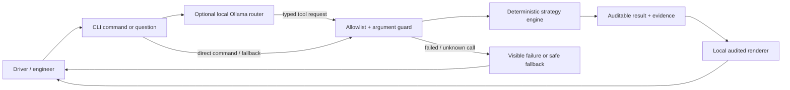

<p align="center">
  
</p>

<h1 align="center">Pitwall Agent</h1>

<p align="center">
  An open-source endurance stint planner with auditable fuel, tyre, driver-rotation, and pit-stop strategy. Local AI is optional.
</p>

<p align="center">
  <a href="https://github.com/Dabi-init/endurance-stint-planner/actions/workflows/ci.yml"></a>
  <a href="https://github.com/Dabi-init/endurance-stint-planner/releases"></a>
  <a href="https://dabi-init.github.io/endurance-stint-planner/"></a>
  <a href="https://github.com/Dabi-init/endurance-stint-planner/actions/workflows/codeql.yml"></a>
  <a href="LICENSE"></a>
  
  
  
</p>

📄 **Website:** <https://dabi-init.github.io/endurance-stint-planner/> ·
📦 **Latest release:** [v0.4.0-alpha.2](https://github.com/Dabi-init/endurance-stint-planner/releases/tag/v0.4.0-alpha.2) ·
⬇️ **Assets:** [wheel](https://github.com/Dabi-init/endurance-stint-planner/releases/download/v0.4.0-alpha.2/pitwall_agent-0.4.0a2-py3-none-any.whl) · [source archive](https://github.com/Dabi-init/endurance-stint-planner/archive/refs/tags/v0.4.0-alpha.2.zip)

Alpha.2 is distributed through GitHub Releases, not PyPI. Every bundled example
is synthetic (Evidence Level C), and no real-session validation is claimed.

Most racing calculators stop at “how many laps fit in a tank?” Pitwall Agent
compares complete, executable strategies: fuel loads and additions, driver
rotation, tyre sets, parallel or sequential pit service, uncertainty, configured
driver rules, and a scoped Safety Car what-if.

It is terminal software—not a website. It works without a language model. If
you connect a local [Ollama](https://ollama.com/) model, the model can translate
plain English into allowlisted race-tool calls. Material race answers are then
rendered locally from successful deterministic tool results; a failed or unknown
tool call cannot ground an answer. The model never receives shell, browser,
deletion, arbitrary-file, or arbitrary-network tools.

Ollama on this computer is the only supported AI provider—there are no cloud
LLM keys or remote model backends. The deterministic engine remains available
without Ollama because race maths should not depend on model availability.

```text
> pitwall compare

Recommendation: Conservative

Rank  Strategy      Projected laps  P10 laps  Pit stops  Reserve  Risk
1     Conservative  174             174.0     6          2 laps   Low
2     Balanced      174             174.0     6          1 lap    Low
3     Fuel Save     174             173.0     6          1 lap    Low

Evidence C · Low confidence · generic manual uncertainty
```

Numbers above are a bundled example, not a performance claim.

## Why this is useful

| Race question | Pitwall answer |
|---|---|
| Which plan should we start with? | A visible three-strategy ranking, not a hidden “AI score” |
| Can we execute it? | Exact stint start/end, driver, laps, fuel start/add, tyre set, and pit time |
| How fragile is it? | Seeded P10–P90 laps, extra-stop risk, source, confidence, and assumptions |
| Is our telemetry credible? | Column mapping, row validity, duplicates, outliers, fuel support, and Evidence Level A/B/C |
| Do driver rules pass? | Independent checks using stable driver IDs, including duplicate display names |
| What if an SC arrives? | One declared pre-race scenario with explicit pace/fuel multipliers and limitations |

The strategy engine is deterministic and independently testable. A small model
can choose the wrong tool or produce weak prose; the final displayed race facts
still come from the successful allowlisted tool result, not from model prose.

## Quick start

Requires a tested [Python 3.11–3.14](https://www.python.org/downloads/) release.

### Windows — easiest

1. [Download the alpha.2 source ZIP](https://github.com/Dabi-init/endurance-stint-planner/archive/refs/tags/v0.4.0-alpha.2.zip) and choose **Extract all**.
2. Double-click `run.bat`.
3. The installer runs a health check and opens the terminal pit wall.

PowerShell users can paste:

```powershell
git clone https://github.com/Dabi-init/endurance-stint-planner.git
Set-Location .\endurance-stint-planner
powershell -ExecutionPolicy Bypass -File .\run.ps1
```

Already cloned with Git?

```powershell
Set-Location .\endurance-stint-planner
git pull
powershell -ExecutionPolicy Bypass -File .\run.ps1
```

### macOS or Linux

```bash
git clone https://github.com/Dabi-init/endurance-stint-planner.git
cd endurance-stint-planner
python3 -m venv .venv
. .venv/bin/activate
python -m pip install -e .
pitwall doctor
pitwall
```

No account, API key, cloud upload, or AI model is required. Every deterministic
fuel, tyre, driver, scenario, comparison, plan, export, and validation function
works in the core-only installation.

### Choose your storage profile — AI is optional

Windows source installs can use the private executable directly:

```powershell
$pitwallPython = ".\.venv\Scripts\python.exe"
```

| Choice | Model storage | Exact opt-in command |
|---|---:|---|
| **Core only / no model** | **0 GB of model storage** | No opt-in is needed. To clear a previous selection, run `& $pitwallPython -m pitwall model off` |
| **Provisional first try:** `qwen3:8b` | About **5.2 GB** | `ollama pull qwen3:8b`, then `& $pitwallPython -m pitwall model use qwen3:8b` |
| **Smaller unverified candidate:** `qwen3:4b` | About **2.5 GB** | `ollama pull qwen3:4b`, then `& $pitwallPython -m pitwall model use qwen3:4b` |

On macOS or Linux, replace `& $pitwallPython -m pitwall` with `pitwall` inside
the activated virtual environment. Model sizes exclude the Ollama application
and its caches. Pitwall never downloads a model automatically.

`pitwall model recommend` runs a read-only deterministic core self-check, then
prints these Ollama-only choices. It never contacts Ollama, downloads a model,
creates a workspace, or changes configuration. Core-only remains the verified
operational path; both model choices are provisional until Pitwall publishes a
real-model tool-calling conformance benchmark.

### Download and disk size

The project is not published on PyPI. Do not use `pip install pitwall-agent`.
Use the versioned alpha.2 source ZIP above, a Git clone, or the wheel attached to
the [GitHub release](https://github.com/Dabi-init/endurance-stint-planner/releases/tag/v0.4.0-alpha.2).
To install extracted source without the launcher:

```powershell
py -3.14 -m venv .venv
.\.venv\Scripts\python.exe -m pip install .
.\.venv\Scripts\python.exe -m pitwall doctor
```

Measured from the current source in a clean Windows/Python 3.14 audit, the wheel
was approximately **92 KB**, the installed Pitwall package files were about
**738 KB**, and the complete private virtual environment was about **27.4 MB**.
An extracted source copy plus its launcher-created environment used about
**28.1 MB**; a Git clone also retains Git history. Exact totals vary by Python
and operating system. The core install downloads its Python runtime
dependencies—it never downloads Ollama or an AI model. The launcher disables
pip's download cache, so the clean audit retained **0 bytes** in its isolated
pip-cache directory.

The Windows launcher opens an interactive prompt. Use `/help`, `/setup`,
`/compare`, `/plan Conservative`, and `/export first-race` there. The direct
PowerShell examples below use the `$pitwallPython` variable defined above.

## Configure a real race

Start from the closest bundled example, then replace only the values you know:

```powershell
& $pitwallPython -m pitwall race init --preset "6h Endurance"
& $pitwallPython -m pitwall race set --name "My 8 Hour" --duration 8 --lap-time 121.4
& $pitwallPython -m pitwall race set --tank 105 --burn 2.72 --refuel-rate 2.4 --tyre-life 30
& $pitwallPython -m pitwall race set --drivers "Ava:Pro:0, Bo:Silver:0.4, Cy:Bronze:1.1"
& $pitwallPython -m pitwall race show
```

The last driver field is pace delta in seconds; omit it if unknown. Use
`pitwall race set --help` for every input. Pitwall preserves the remaining
preset values so you can configure the race gradually.

## First analysis in five commands

This telemetry example assumes you installed from the source ZIP or a Git
checkout, because `examples/spa_6h_synthetic.csv` is not included in the wheel.
Wheel users can [download the sample CSV directly](https://raw.githubusercontent.com/Dabi-init/endurance-stint-planner/main/examples/spa_6h_synthetic.csv)
or skip steps 4–5.

```powershell
# 1. Check the installation
& $pitwallPython -m pitwall doctor

# 2. Create the current editable race
& $pitwallPython -m pitwall race init

# 3. Compare the current assumptions
& $pitwallPython -m pitwall compare

# 4. Import one-row-per-lap telemetry
& $pitwallPython -m pitwall ingest .\examples\spa_6h_synthetic.csv

# 5. Compare again using supported telemetry fields
& $pitwallPython -m pitwall compare

# Then create a crew-readable Markdown sheet
& $pitwallPython -m pitwall export --name first-race
```

Files stay in the current folder’s `.pitwall` directory:

```text
.pitwall/
├── config.toml       # model selection and privacy setting
├── data/             # explicitly ingested CSV files
├── reports/          # new, non-overwriting pit sheets
├── history.jsonl     # local agent turns, if enabled; automatically size-bounded
├── race.json         # current car, race, drivers, and regulations
└── state.json        # active preset and telemetry
```

## Optional: add a local Ollama model

Pitwall uses Ollama’s documented chat and tool-calling API directly. Ollama is
the product's only model provider; it is always local and opt-in. If you want
natural-language routing, `qwen3:8b` is the provisional first model to try:

```powershell
ollama pull qwen3:8b
& $pitwallPython -m pitwall model list
& $pitwallPython -m pitwall model use qwen3:8b
& $pitwallPython -m pitwall ask "Can we remove a stop, and what do we give up?"
```

[`qwen3:8b`](https://ollama.com/library/qwen3) is about **5.2 GB**. The smaller
unverified `qwen3:4b` candidate is about **2.5 GB** and uses the same
`ollama pull` then `pitwall model use` flow shown above. Neither has passed a
published Pitwall conformance suite or is guaranteed for every computer or
strategy question. [Ollama's Windows installation](https://docs.ollama.com/windows)
requires at least **4 GB**, so an 8B setup needs roughly **9.2 GB or more** before
caches and other models. `pitwall doctor` checks whether the selected model is
installed, but real tool-selection quality still depends on the model.

Run `& $pitwallPython -m pitwall model off`, then `ollama rm qwen3:8b` or
`ollama rm qwen3:4b`, to stop using and remove a model; uninstall Ollama if you
no longer need the runtime. Every deterministic command keeps working. Pitwall
only accepts an Ollama endpoint on this computer.

The Ollama integration is real, but this alpha has not published a real-model
conformance benchmark. Direct deterministic commands remain the recommended
operational path.

## Commands

| Command | Purpose |
|---|---|
| `pitwall` | Open the interactive strategist; type `/help` for setup, compare, plan, and export commands |
| `pitwall welcome` | Plain-English introduction for people new to endurance strategy |
| `pitwall doctor` | Verify the core, workspace, configuration, and optional Ollama |
| `pitwall model recommend` | Run a read-only core self-check and print provisional Ollama choices without downloading or changing anything |
| `pitwall init` | Create the `.pitwall` workspace; add `--guided` to create `race.json` interactively |
| `pitwall race init` | Create the current editable race from a bundled preset |
| `pitwall race set` | Update car, event, service, or driver inputs |
| `pitwall race show` | Inspect the exact current inputs |
| `pitwall compare` | Rank Conservative, Balanced, and Fuel Save |
| `pitwall plan` | Print one complete deterministic plan |
| `pitwall ingest FILE.csv` | Copy and audit telemetry inside the workspace |
| `pitwall scenario 120 20` | Simulate an SC at minute 120 for 20 minutes |
| `pitwall ask "..."` | Use Ollama when configured, safe deterministic routing otherwise |
| `pitwall export --name race-one` | New pit sheet for the recommended strategy; `--strategy` overrides |
| `pitwall validate --actual-laps 210` | Compare a reported result with the plan (Evidence Level C) |
| `pitwall tools` | Inspect the model’s complete tool allowlist |
| `pitwall history` | Review locally saved agent turns |
| `pitwall --json compare` | Produce machine-readable output for automation |

`pitwall export` writes the recommended strategy unless you pass `--strategy`.
Alpha.1 introduced `pitwall welcome`, `pitwall init --guided`, and
`pitwall validate`. Alpha.2 hardens failure handling,
storage bounds, installation, and local-AI grounding.

Run `pitwall COMMAND --help` for every option.

Local history does not grow forever: individual stored turns are truncated at
20,000 characters, and `history.jsonl` compacts after roughly 5 MB while keeping
the most recent portion. Telemetry imports are explicit, capped at **10 MiB and
50,000 rows per CSV**, and limited to **100 MiB** in `.pitwall/data`. Local
Ollama responses are capped at 8 MiB. App-created reports and validations are
capped at **2 MiB each**, **25 MiB combined**, and **500 files**; existing files
are never silently replaced.

## Telemetry contract

CSV grain is one row per completed car lap. Header aliases are accepted for:

- lap number and lap time;
- fuel remaining;
- driver;
- tyre age;
- track status;
- pit-lap flag.

Unsupported columns are ignored. Sparse or invalid telemetry lowers the quality
score; unsupported fuel estimates are withheld instead of guessed. The bundled
sample is intentionally marked **synthetic** and remains **Evidence Level C**
even when its rows are clean. See [examples/README.md](examples/README.md).

## Trust model


```mermaid
flowchart LR
    U["Driver / engineer"] --> CLI["CLI command or question"]
    CLI --> LLM["Optional local Ollama router"]
    LLM -->|"typed tool request"| G["Allowlist + argument guard"]
    CLI -->|"direct command / fallback"| G
    G --> E["Deterministic strategy engine"]
    E --> R["Auditable result + evidence"]
    R --> V["Local audited renderer"]
    V --> U
    G -->|"failed / unknown call"| F["Visible failure or safe fallback"]
    F --> U
```

For material race questions, the model may route the request but does not own
the final answer. Only a successful allowlisted deterministic tool result may
ground the locally rendered race facts.

The detailed product reasoning and attack map live in
[docs/AGENT_BRAIN.md](docs/AGENT_BRAIN.md). The deterministic race model is
specified in [docs/STRATEGY_BRAIN.md](docs/STRATEGY_BRAIN.md), and module
boundaries are in [docs/ARCHITECTURE.md](docs/ARCHITECTURE.md).

## Glossary

New to endurance strategy? Run `pitwall welcome` for the same explanations in
your terminal.

- **Stint** — the run between two pit stops. Its length is limited by whichever
  runs out first: fuel, tyre life, or the maximum time a single driver may stay
  in the car.
- **Fuel reserve** — a deliberate safety buffer counted in whole laps that the
  plan never spends. A larger reserve is safer but costs laps over the race.
- **Tyre life** — how many laps you are willing to run one set of tyres. A stint
  longer than the tyre life needs an extra tyre change, or a shorter stint.
- **P10 / P90** — for projected laps, P10 is the fewer-laps case and P90 the
  more-laps case. Raw lap-time percentiles run in the opposite direction because
  fewer seconds is faster, so always read the metric-specific label. Plan for
  the pessimistic bound; do not promise the optimistic one.
- **Evidence Level A / B / C** — A means several audited real sessions, B means
  one audited real session, C means assumed, preset, or synthetic values.
  Anything at Level C is an estimate, not a measurement.
- **Parallel vs sequential pit service** — parallel service overlaps refuelling,
  tyres, and the driver change, so the stop costs roughly the longest single
  job. Sequential service runs them one after another, so the stop costs the
  sum. Your event regulations decide which applies.
- **Safety Car scenario** — a what-if you declare yourself by giving a
  deployment minute and a duration. Pitwall receives no live race control data
  and cannot predict real Safety Car events.
- **Trigger card** — one thing to watch during the race, the band it should stay
  inside, and the action agreed in advance if it leaves that band: `HOLD` the
  plan or `RECONSIDER` it with a fresh calculation.
- **Deterministic engine** — the auditable calculator that produces every
  number. The same inputs always give the same outputs. The optional local model
  may route a question into an allowlisted tool; Pitwall renders the displayed
  answer locally from the successful deterministic result.
- **Telemetry** — an optional one-row-per-completed-lap CSV of your own data.
  Without it Pitwall labels the run `Manual assumptions` and stays at Evidence
  Level C.

## Honest scope

Pitwall Agent is pre-race decision support in alpha. It does not currently
provide live timing, weather, traffic, competitors, wave-by, pit-closure, class
split, championship-specific rule packs, or validated real-session accuracy.
Always verify the official event regulations and live fuel data.

The engine is credible when its assumptions match your race—not because an AI
described it confidently. Real-session predicted-versus-actual validation is
the largest remaining product gap.

## Development

```powershell
python -m venv .venv
& .\.venv\Scripts\python.exe -m pip install -e ".[dev]"
& .\.venv\Scripts\python.exe -m ruff check .
& .\.venv\Scripts\python.exe -m ruff format --check .
& .\.venv\Scripts\python.exe -m pytest --cov
& .\.venv\Scripts\python.exe -m build
```

Contributions are welcome. Start with [CONTRIBUTING.md](CONTRIBUTING.md), the
[ROADMAP.md](ROADMAP.md), or an issue template. Security and model-boundary
reports belong in [SECURITY.md](SECURITY.md).

## Design influences

The local-first, tool-using software direction is informed by
[Odysseus](https://github.com/odysseus-dev/odysseus),
[Hermes Agent](https://github.com/NousResearch/hermes-agent), and
[Ollama tool calling](https://docs.ollama.com/capabilities/tool-calling).
Pitwall deliberately takes a narrower domain approach: a race strategist with
audited motorsport tools, not a general-purpose computer agent.

## License

[MIT](LICENSE)
