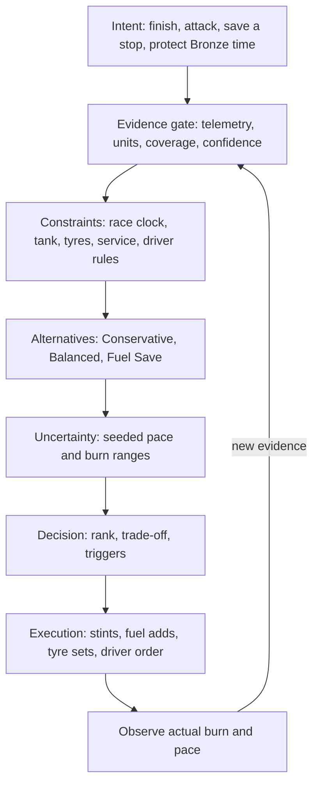
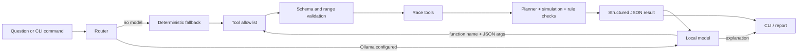

# Pitwall Agent Brain

This is the product and safety contract for Pitwall Agent. It answers a simple
question: how can a small local model improve the interface without weakening
the race decision?

## North star

> Turn incomplete race evidence into an executable, auditable pre-race plan,
> then explain what would make that plan change.

The product is not “chat with a stint calculator.” It is a terminal pit-wall
workspace in which deterministic tools own every material race number and the
optional model acts as interpreter, tool router, and explainer.

## Endurance-strategist map

Strategy priority is legality and feasibility, finishability, classified laps,
operating margin, pit time, then simplicity. A shorter central estimate never
outranks a knowingly infeasible plan.

## Software map

The model cannot:

- execute a shell command;
- browse the web;
- read an arbitrary local path;
- delete or overwrite files;
- call an unknown function;
- choose an arbitrary HTTP endpoint;
- run more than six tool rounds;
- silently replace deterministic results.

Telemetry first enters through `pitwall ingest`. It is copied into
`.pitwall/data`; model tools can only address safe file names in that directory.
CSV cell text is always data, never a prompt.

## Tool contract

| Tool | Decision | Writes? |
|---|---|---|
| `plan_race` | Produce one executable stint plan | No |
| `compare_race_strategies` | Rank three transparent alternatives | No |
| `inspect_telemetry` | Audit quality and supported calibration | No |
| `check_driver_rules` | Check configured driver constraints | No |
| `simulate_safety_car` | Evaluate one declared SC scenario | No |
| `export_pit_sheet` | Create a crew-readable report | New file only |

Each tool has a JSON schema, rejects extra arguments, validates ranges, catches
domain errors, and returns `{ok: false, error: ...}` instead of exposing a raw
exception to the model.

## Small-model design

Small local models are expected to:

- omit required arguments;
- invent a tool name;
- answer without calling a tool;
- repeat the same tool;
- mix explanation with unsupported certainty;
- fail or time out.

Pitwall makes those failures visible and recoverable:

1. malformed and unknown calls fail inside the allowlist;
2. strategy prose without a race-tool call is replaced by an audited comparison;
3. repeated calls stop at a fixed step limit;
4. an unavailable Ollama model falls back to deterministic intent routing;
5. direct commands remain the recommended operational path;
6. tool results include evidence, assumptions, and warnings for the model to cite.

The language model is optional because reliability should not depend on prompt
quality, GPU memory, model release, or an internet service.

## Failure and loophole attack map

| Attack | Expected safe behaviour | Automated evidence |
|---|---|---|
| Model calls `run_shell` | Unknown tool; nothing executes | agent test |
| Model adds an unexpected argument | Call rejected before handler | agent test |
| Model omits SC duration | Call rejected before handler | agent test |
| Model loops forever | Stops at configured maximum | agent test |
| Model returns strategy prose without tools | Answer is replaced by an audited comparison | agent test |
| Ollama is stopped | Deterministic fallback remains usable | provider/CLI test |
| Ollama host points off-device | Configuration rejected | configuration test |
| CSV contains prompt injection | Text ignored as an unmapped data field | telemetry/agent test |
| Tool asks for `../secret.csv` | Workspace boundary rejects it | workspace test |
| Report name already exists | Existing file remains untouched | CLI test |
| Slow versus fast refuelling | Pit time and laps materially change | engine test |
| Final stint overfuel | Exact need plus reserve | engine test |
| Duplicate driver names | Stable IDs preserve independent rules | engine test |
| SC multipliers are cosmetic | Scenario laps and fuel change | engine test |
| Simulation looks precise but is random | Fixed seed reproduces result | engine test |
| Synthetic data appears validated | Evidence remains Level C | telemetry test |

## Memory and privacy

There is no hidden user profile or cloud telemetry. When enabled,
`history.jsonl` stores only timestamp, session ID, role, text, and tools used.
It is visible, portable, and can be disabled in `config.toml`.

The active telemetry name and preset live in `state.json`. No credentials are
stored. The current event inputs live in `race.json`. Ollama is restricted to
loopback hosts.

## 9/10 gates

| Area | Evidence required for 9/10 |
|---|---|
| Product usefulness | Offline compare/plan/ingest/scenario/export journey plus optional plain-English agent |
| Model credibility | Deterministic arithmetic, visible evidence levels, bounded tool schemas, adversarial tests |
| Engineering | Installable package, console entry point, typed modules, lint, multi-version tests, coverage, wheel smoke test |
| Repository presentation | Honest top fold, paste-ready setup, command demo, architecture, scope, roadmap, changelog |
| Discoverability | Domain name/tagline, GitHub topics, social image, first release, example case study |
| Profile credibility | Accurate public bio/README and link to the project; no placeholder expertise claims |
| Community readiness | Contribution/security/conduct guides, issue/PR templates, roadmap, Discussions, labelled starter issues |

The repository can earn a strong 9/10 foundation. A real 10/10 still requires
external users, anonymised real-session validation, sustained releases, and
evidence that predicted decisions match race outcomes.

## Build–attack–repair loop

Every product increment follows the same endurance-race discipline:

1. define the decision and failure cost;
2. add the smallest transparent tool or rule;
3. test the representative case;
4. attack bad data, boundaries, identity collisions, and model misuse;
5. narrow the claim or fix the defect;
6. run lint, tests, coverage, packaging, and a clean CLI smoke test;
7. publish remaining uncertainty.
