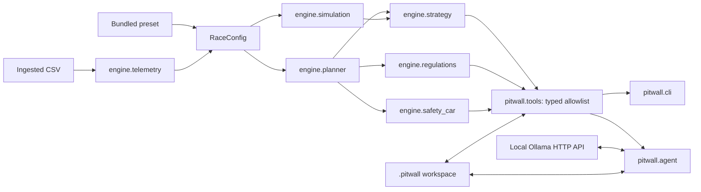

# Architecture

Pitwall Agent has two layers with a strict one-way dependency: the agent and CLI
may call the race engine; the engine knows nothing about Typer, Rich, Ollama, or
chat.



## Modules

| Module | Responsibility |
|---|---|
| `engine.models` | Typed race configuration and results |
| `engine.planner` | Exact stint, fuel, tyre, driver, and service accounting |
| `engine.simulation` | Seeded uncertainty sampling around the same planner |
| `engine.strategy` | Candidate generation and visible lexicographic ranking |
| `engine.regulations` | Independent configured driver-rule evidence |
| `engine.safety_car` | One declared, scoped pre-race scenario |
| `engine.telemetry` | CSV mapping, quality scoring, and supported calibration |
| `pitwall.workspace` | Path boundary, ingestion, state, reports, settings |
| `pitwall.tools` | Model-visible schemas, validation, and result serialization |
| `pitwall.providers` | Loopback-only Ollama API boundary |
| `pitwall.agent` | Bounded tool loop and deterministic fallback |
| `pitwall.cli` | Human terminal commands and presentation |

## Timing model

A stint consumes driving time. A stop consumes:

```text
pit-lane transit + max(refuel, tyres, driver change)   # parallel service
pit-lane transit + refuel + tyres + driver change     # sequential service
```

Fuel loaded for each stint is its planned burn plus reserve, capped by the
usable tank. Carried reserve remains in the car; the next fuel add is the
difference between target start load and remaining fuel.

## Strategy selection

The comparison is lexicographic and visible:

1. feasibility;
2. median simulated laps;
3. P10 laps;
4. deterministic laps;
5. lower pit time;
6. lower extra-stop probability;
7. higher explicit reserve when all performance/risk measures tie.

There is no weighted language-model score.

## Ollama routing loop

1. The agent sends a fixed safety policy, the user question, and the six JSON
   tool schemas to `/api/chat`.
2. Each requested call is checked for known name, relevance, argument schema,
   range limits, total-call caps, and explicit consent for report export.
3. Failed or irrelevant calls may be returned to Ollama for one bounded retry.
4. The first successful relevant deterministic result is rendered locally and
   returned immediately. Unchecked model prose is never the final race answer.
5. A response can request at most three calls, a question at most eight calls,
   and the loop at most six rounds by default.

If Ollama is disabled, unreachable, malformed, or slow, deterministic commands
and the keyword fallback remain available.

## Persistence and writes

All runtime state stays under the selected `.pitwall` root. Ingestion copies a
bounded CSV into `data/`; file arguments are reduced to a safe base name.
Workspace mutations use atomic/exclusive writes and a cross-process lock.
Telemetry, history, reports, and validations have explicit size/count quotas.
Export creates a new file under `reports/` and refuses to overwrite. The agent
has no deletion path.

## Safety Car scope

The Safety Car module maps one declared window into a green-equivalent race
clock and weighted fuel estimate. It can apply reduced pit-lane transit to at
most one stop already inside that window. It does not model race-control feeds,
pit closure, wave-bys, class traffic, or competitors.
