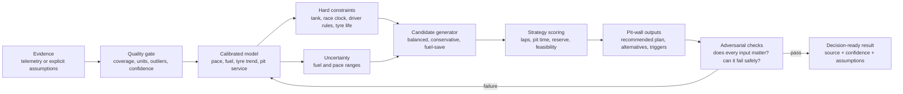

# Strategy Brain

This document is the deterministic decision contract for Pitwall Agent. It exists to
stop the product becoming a polished calculator with weak race logic.

## North-star decision

> Given our evidence, constraints, and uncertainty, which executable stint plan
> gives the car the best chance of completing the most classified laps without
> creating an avoidable fuel, tyre, or driver-regulation failure?

The lab is pre-race decision support. It is not a live timing system, race-control
feed, or substitute for the sporting regulations of a specific championship.

## The reasoning map

## Race-strategist hierarchy

The engine resolves decisions in this order:

1. **Safety and legality** — never recommend an impossible fuel load or a plan
   that knowingly breaks configured driver limits.
2. **Finish the race clock** — model driving time and pit service time separately.
3. **Maximise classified laps** — compare complete race plans, not isolated stint
   lengths.
4. **Protect operating margin** — retain explicit fuel reserve and surface tyre
   and driver risks.
5. **Reduce stationary time** — account for transit loss, fuel flow, tyre work,
   and driver change, including parallel versus sequential service.
6. **Keep the plan executable** — publish exact fuel adds, tyre sets, driver
   sequence, pit timing, and the assumptions that would trigger a change.

## Evidence ladder

Every result carries one of these evidence levels:

| Level | Input | Allowed claim |
|---|---|---|
| A | Clean session telemetry with enough representative green laps | Calibrated estimate with measured ranges |
| B | Partial telemetry plus explicit manual inputs | Indicative estimate with visible gaps |
| C | Manual assumptions or synthetic example | Scenario exploration only |

Synthetic data must always be labelled synthetic. A confidence score describes
input fitness; it does not turn a simplified model into a validated race model.

## Model contract

Every user-facing input must satisfy all four tests:

- It changes at least one relevant calculation.
- Its unit and safe range are visible.
- Its source is recorded as telemetry-derived or manually assumed.
- A focused test proves a meaningful output changes when the input changes.

Every strategy result must expose:

- expected laps and pit stops;
- total pit time and exact per-stop fuel adds;
- fuel used and remaining reserve;
- driver time and configured rule compliance;
- tyre-set allocation;
- source, assumptions, warnings, and confidence;
- at least one viable alternative or a clear explanation that none is feasible.

## Candidate strategies

The first useful version compares three deliberately different plans:

| Candidate | Intent | Typical trade-off |
|---|---|---|
| Conservative | Extra reserve and lower operational risk | More fuel carried or an earlier stop |
| Balanced | Best central estimate under configured constraints | Less protection against model error |
| Fuel Save | Lower burn with an explicit pace penalty | Can remove a stop only if the race-clock maths supports it |

The preferred strategy is ranked by feasibility, median laps, P10 laps, central
laps, pit time, extra-stop probability, then explicit reserve. It must never be
selected by a hidden magic score alone.

## Failure and loophole map

These are release-blocking failures:

| Failure mode | Attack test | Required behaviour |
|---|---|---|
| A control is cosmetic | Sweep it across realistic extremes | Affected output changes or the control is removed |
| Refuel speed is ignored | Compare slow and fast fuel flow | Pit time and potentially race laps change |
| Safety-car pace is ignored | Compare 1.1x and 3.0x lap multipliers | Laps/fuel/timing change materially |
| Final stint is overfuelled | End race shortly after a stop | Final load equals need plus reserve, capped by tank |
| Duplicate names merge drivers | Add two drivers with the same display name | Stable IDs keep their totals and rules separate |
| Pit service is double-counted | Toggle parallel/sequential service | Time follows the declared service model |
| Tyre age resets accidentally | Double-stint a tyre set | Age carries across the stop |
| Impossible regulations appear valid | Create an unsatisfiable minimum/maximum | Plan is flagged infeasible with a remedy |
| Garbage telemetry looks authoritative | Upload missing, sparse, or non-monotonic data | Quality falls and unsupported estimates are withheld |
| Synthetic evidence looks real | Use bundled example | Every relevant screen/export says “synthetic” |
| One deterministic answer implies certainty | Widen fuel/pace ranges | Outcome band widens and confidence/risk changes |
| Terminal hides the decision | Run the default comparison | Recommendation, alternatives, risk, and source appear first |

## 9/10 release gates

A score is earned only when its gate is evidenced.

| Area | 9/10 gate |
|---|---|
| Product usefulness | A user can ingest generic lap telemetry, compare credible strategies, inspect risks, and export an executable pit sheet in one terminal workflow |
| Model credibility | All material assumptions are sourced or labelled, uncertainty is visible, and adversarial tests cover fuel, service, tyres, safety car, and driver rules |
| Engineering | One maintained architecture, typed core, automated lint/test/coverage checks, deterministic simulation, and no known high-severity defect |
| Repository presentation | Honest top-fold README, clear quick start, architecture/limitations, terminal demonstration, example data, and reproducible results |
| Discoverability | Strong description/topics/social image, paste-ready local demo path, tagged release, and a concrete synthetic case study |
| Profile credibility | Accurate bio and profile README focused on the project and its evidence; no placeholder claims or links |
| Community readiness | Contribution guide, code of conduct, security policy, issue/PR templates, roadmap, good-first issues, and Discussions enabled where available |

“10/10” is not a launch-day claim. It requires external users, championship-level
validation data, sustained maintenance, and evidence that recommendations match
real decisions. The rebuild targets a defensible 9/10 foundation and will report
any gate that still depends on external adoption or platform access.

## Build–attack–repair loop

For each increment:

1. State the race decision it supports.
2. Implement the smallest transparent model that supports it.
3. Write the normal-case test.
4. Attack boundary values, duplicate identities, missing data, and contradictory
   constraints.
5. Trace surprising results to an assumption or defect.
6. Repair the defect or narrow the claim.
7. Run core, integration, CLI, package, and clean-install checks.
8. Record remaining limitations before publishing.
